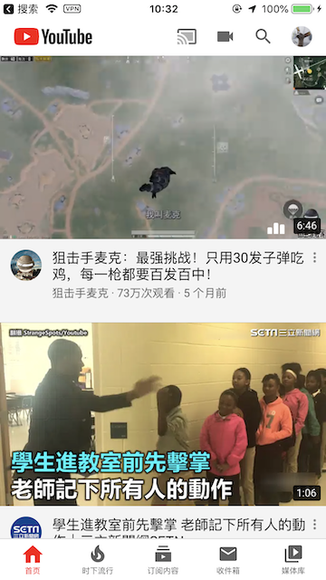

# SwiftV2Ray
在真机上运行这个工程需要拥有解锁NetworkExtension能力的证书（Provisioning Profile），而这里我所使用的方法是在越狱机器上绕开Apple的限制，具体方法可以参考[这篇文章](https://hello-david.github.io/archives/61787736.html)。

1. 这个项目仅作为个人学习用途（SwiftUI/NetworkExtension）
2. 使用[这个issue](https://github.com/v2ray/v2ray-core/issues/1341)中讨论的Tun2socks进行Vmess协议解析

